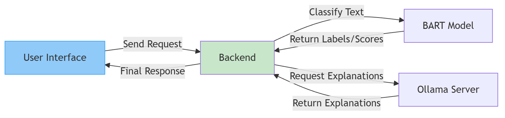
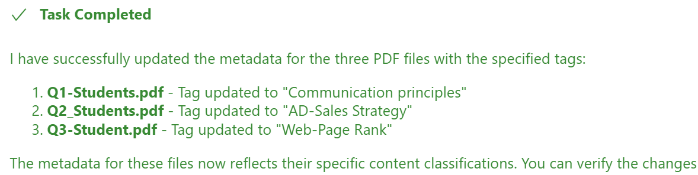

# EIE3280Project

## Abstract
We present an integrated system for novice academic researchers that combines two complementary components:  
1. **AcBART**, a zero-shot text‐classification plugin that transforms fuzzy user descriptions into precise academic keywords (based on the ACM CCS taxonomy)
2. **MongoPDF**, a privacy-preserving local PDF management and context retrieval framework built on the Model Context Protocol (MCP) and MongoDB GridFS

Together, these modules enable users to rapidly refine search queries on Google Scholar and perform accurate, on-device document retrieval without exposing sensitive content to external servers.

## Modules

### AcBART
- Encoder-only adaptation of Facebook’s BART model for two-stage classification (Major → Minor)  
- Uses ACM CCS (13 top-level categories, 872 leaf classes)  
- Browser extension demo: suggests precise ACM CCS labels from natural language descriptions  

<em>Figure 1. AcBART Architecture</em>

**Work Flow**

When user input a description, AcBART will list several most likely major labels and ask user to choose a major label, then AcBART will show several most likely minor label, after user choose the minor label, AcBART will search this minor label directly in Google Scholar.

**Major Contributions**

1. **AI Classification in Chrome Extension**  
   First to embed AcBART into Google Scholar via a Chrome extension, guiding users through intuitive text‐input and click interactions and offering optional Ollama‐powered term explanations.

2. **Lightweight Local Inference**  
   Runs entirely on low‐end PCs or laptops without dedicated GPUs, eliminating cloud dependency and reducing user costs.

3. **High‐Speed Performance**  
   Delivers results in an average of 0.5961 seconds per request (measured on an NVIDIA RTX 3070 Ti Laptop GPU with an AMD Ryzen 9 6900HS), ensuring rapid, seamless user experience.

Here are Usage Demo for using AcBART Plugin in Google Scholar:

### MongoPDF

- Content-aware classification assigning semantic labels to PDFs in MongoDB GridFS  
- Label-enforced full-text retrieval under specific tags for coherent, high-precision context  
- Direct ingestion of GridFS document chunks into the LLM to minimize metadata overhead and maximize context per query  

<em>Figure 2. MongoPDF Architecture</em>

**Work Flow**

  Users communicate with the Cline interface using natural language, which subsequently invokes our MCP server MongoPDF. MongoDB supplies data to the MongoPDF server. The MongoPDF server processes the data and transmits the data embeddings back to Cline. The Cline then forwards these prompts and data embeddings to the Large Language Model (LLM). The LLM's response will be delivered back to the Cline and shown to the user.

**Major contributions**

- **Automatic Document Classification**  
  We implement a content-aware classification mechanism that automatically assigns semantic labels to documents imported into MongoDB GridFS, facilitating structured management and query optimization.

- **Label-Enforced Contextual Retrieval**  
  Unlike typical RAG pipelines that rely on shallow retrieval of sparse fields, our system enforces the model to directly read full-text content under specific labels in MongoDB. This preserves contextual coherence, enhances logical reasoning, and significantly improves both precision and response speed.

- **Chunk-Level Model Input via GridFS**  
  We directly feed GridFS document chunks into the LLM pipeline. By avoiding redundant metadata, this approach alleviates the burden on the model’s context window and enables processing of larger volumes of document content within a single query.

<em>Figure 3. MongoPDF Output</em>

